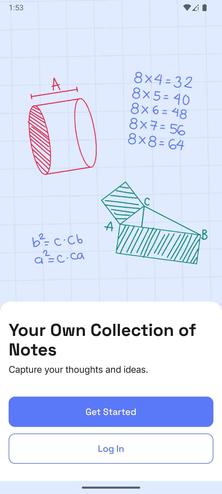
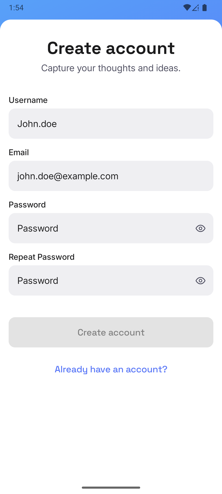
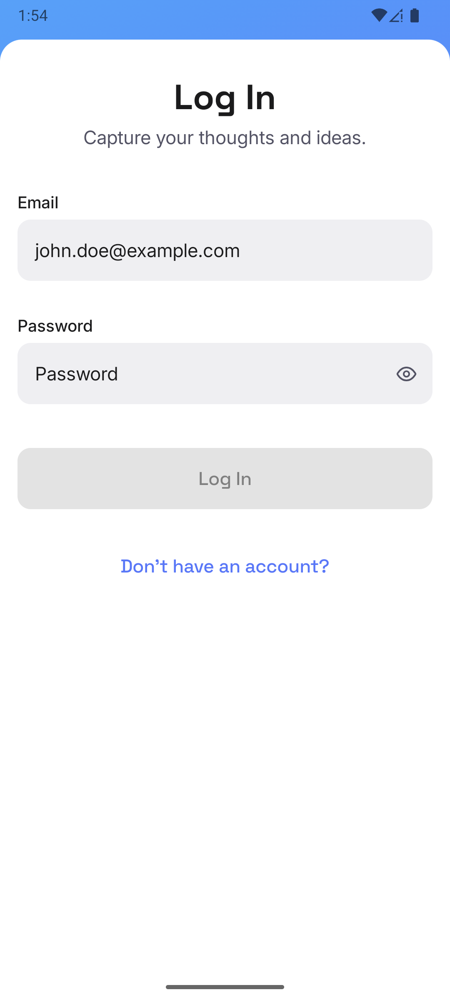
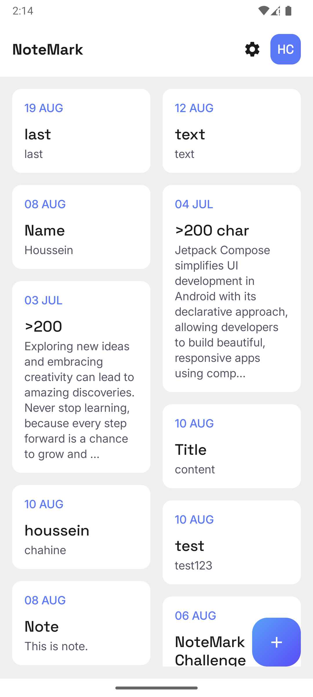
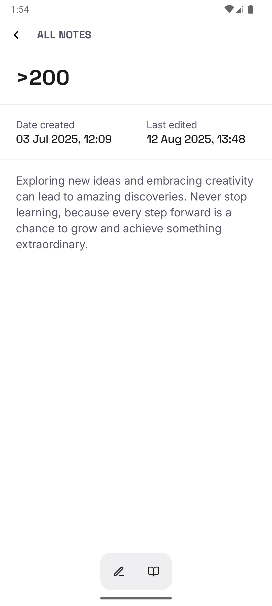
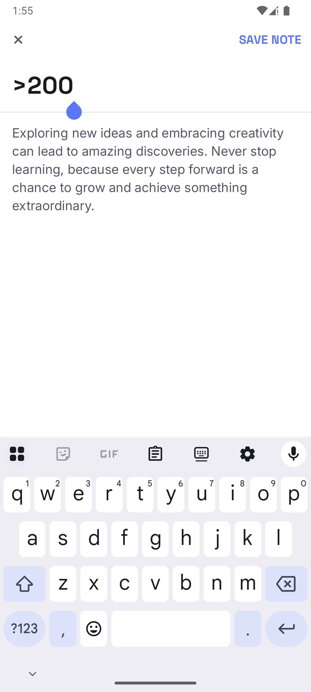
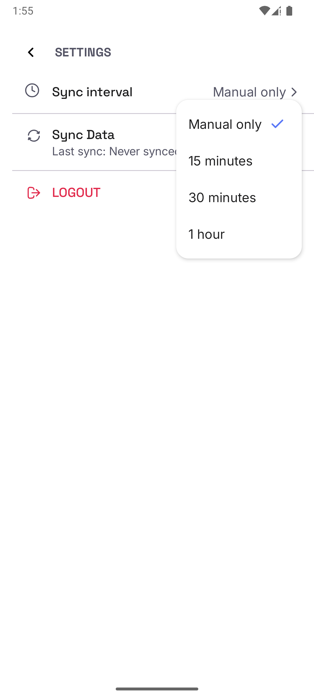

# 📝 NoteMark
> A **secure, offline-first note-taking app** with authentication, encrypted storage, and seamless sync.  
> Built with **Jetpack Compose, Koin, Room, DataStore, Ktor, Paging 3,  WorkManager, Broadcast Receiver, and Firebase**.

---

## Features
- 🔐 **User Authentication** – Secure login and registration.
- 🔒 **Encrypted Data Storage** – Tokens are encrypted before being stored locally.
- 📶 **Offline-First with Paging 3 + RemoteMediator**
    - Notes are **always loaded from local database first** for instant access.
    - Remote updates are fetched in the background and merged into the cache.
- 🔄 **Seamless Sync**
    - Automatic sync with **WorkManager** at intervals(15,30) minutes or (1) hour.
    - Manual sync option available.
    - Broadcast receiver triggers sync on **device reboot**.
- 🖥 **Responsive Design** – Optimized for mobile & tablets for Portrait & Landscape.  

---

## 🛠 Tech Stack

- **Kotlin** – Modern Android development.
- **Jetpack Compose** – Declarative UI.
- **Room Database** – Local persistence.
- **Paging 3 + RemoteMediator** – Offline-first pagination.
- **WorkManager** – Background sync jobs.
- **Hilt (DI)** – Dependency injection.
- **Coroutines + Flow** – Async programming and reactive streams.
- **DataStore(with custom encryption)** – Secure storage of authentication/session data using AES with Android Keystore..

---

## 📲 Screenshots

<div style = "text-align: center;">
  
  
 
 
 
 
 
 
</div>  

---

## 🚀 How It Works

1. User logs in → Notes are fetched from server & cached locally.
2. User creates/updates/deletes a note offline → Changes saved locally.
3. Sync process:
  - **WorkManager** (scheduled job)
  - **Manual sync** (user action)
  - **BroadcastReceiver** (on reboot)
4. 📶 **Paging 3 + RemoteMediator**
  - Fetches notes from the **remote source first**.
  - On success, notes are **saved locally**, replacing old notes.
  - On failure (no internet or server failure), loads notes from **Room database** so the app remains usable offline.

---

## 📦 Project Setup

Clone the repo:

```bash
git clone https://github.com/Smikey1/NoteMark
cd NoteMark
```